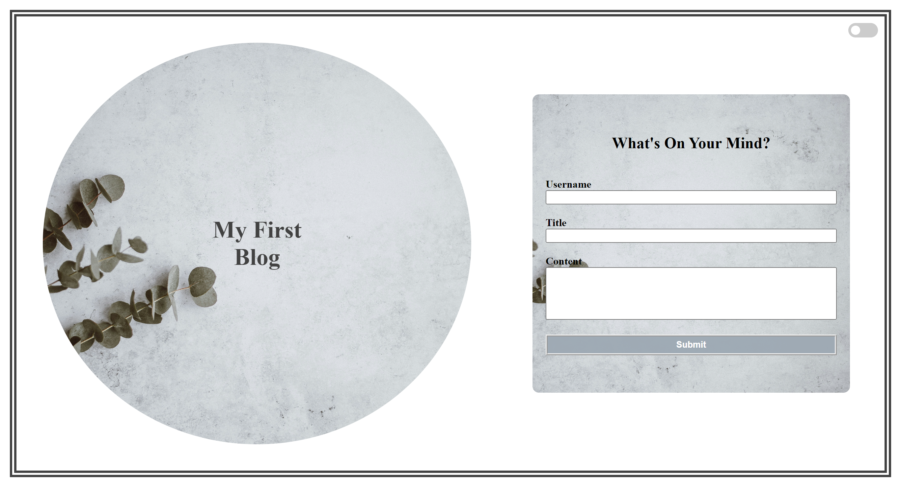

# Personal Blog

## Description

The purpose for developing this project was to dynamically render blog posts from a user's form input through the use of JavaScript and local storage. This allows a user to add new blog post content that is then displayed along with previous blog content that was saved in local storage. This project allowed me to utilize the use of local storage and become more familiar with it by taking a user's input and putting that into local storage then retrieving the data from local storage so it could be displayed as a blog post.  It also furthered my experience with Javascript and CSS to establish the overall functionality and styling of the blog.

## Usage

After the application is loaded the user will be met with the landing page where there is a form to input their username, blog title, and blog content. They will also have the option to toggle between light mode and dark mode. If the user tries to submit the form without providing input, then they will receive a notification saying that an input is needed before the form can be submitted. After the user can submit the form, they are then taken to the second page with the blog content. The newest blog content is added at the bottom with the previous content being shown at the top. The user can also toggle between a light and dark mode on the blog content page. If the user wants to add more blog content, then they can use the back button to go back to the landing page.

    

   

## Credits

Light Mode Photo by <a href="https://unsplash.com/@anniespratt?utm_content=creditCopyText&utm_medium=referral&utm_source=unsplash">Annie Spratt</a> on <a href="https://unsplash.com/photos/green-plant-OTy0mkqc2Yk?utm_content=creditCopyText&utm_medium=referral&utm_source=unsplash">Unsplash</a>
  

  Dark Mode Photo by <a href="https://unsplash.com/@lereverdo?utm_content=creditCopyText&utm_medium=referral&utm_source=unsplash">Valeria Reverdo</a> on <a href="https://unsplash.com/photos/a-close-up-of-a-black-surface-dwy2meBFqW8?utm_content=creditCopyText&utm_medium=referral&utm_source=unsplash">Unsplash</a>
  

